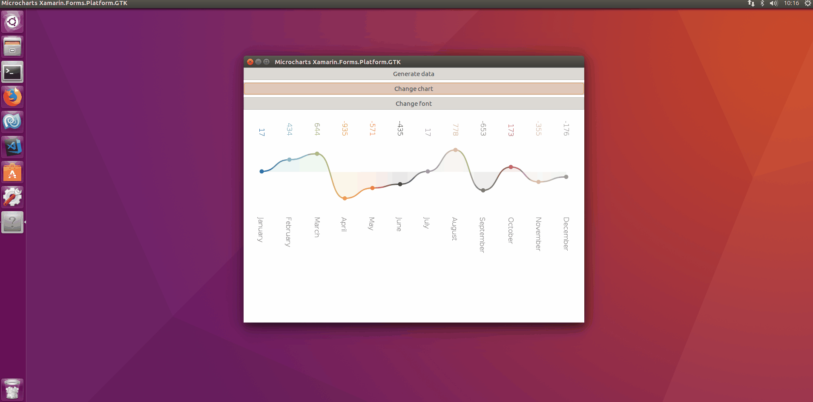

# Microcharts GTK Samples

[Microcharts](https://github.com/aloisdeniel/Microcharts) is an extremely simple charting library for a wide range of platforms (see Compatibility section below), with shared code and rendering for all of them!. Created by [Aloïs Deniel](https://github.com/aloisdeniel) and using SkiaSharp.

In this repository we created a small sample to test Microcharts with Xamarin.Forms **GTK** backend (**Linux**).

To run SkiaSharp on a Mono application on Linux:

    wget https://github.com/mono/SkiaSharp/releases/download/v1.60.2/libSkiaSharp.so
    sudo mkdir /usr/lib/cli/skiasharp
    sudo cp ./libSkiaSharp.so /usr/lib/cli/skiasharp/
    sudo nano /etc/mono/config
    
## Copyright and license

Code released under the [MIT license](https://opensource.org/licenses/MIT).